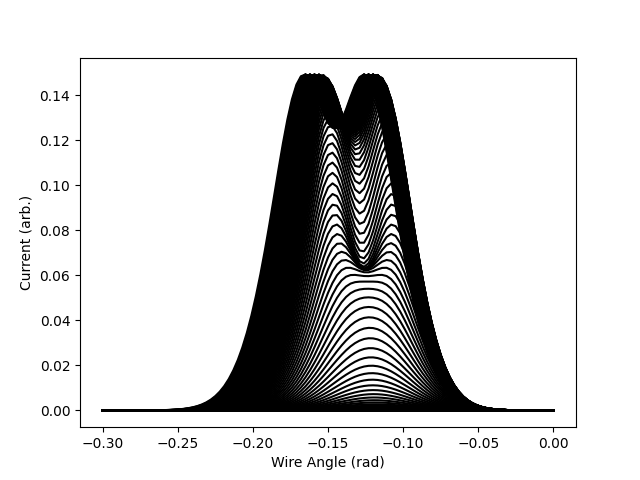
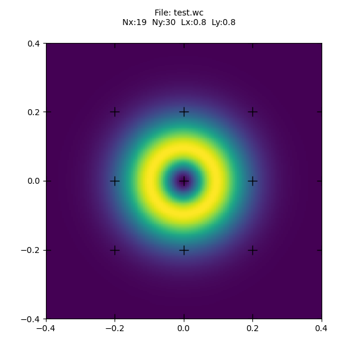
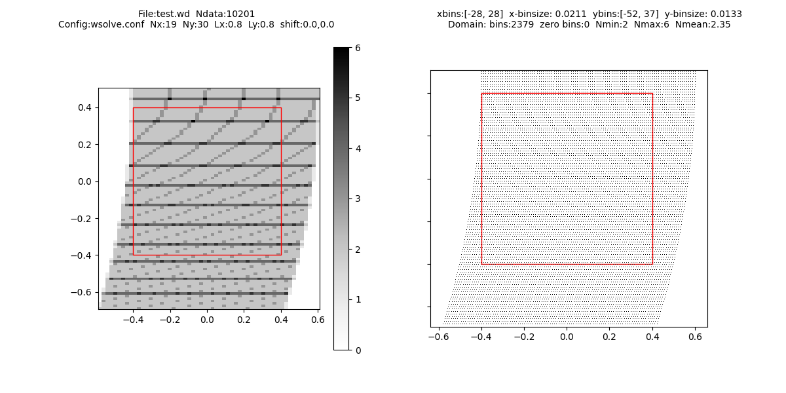

# WIRE <a name="top"></a>

The WIRE repository provides numerical tools for calculating spatially resolved ion current densities given many individual cylindrical (wire) Langmuir probe measurements.  

- [Introduction](#intro)
- [Tools](#tools)
	- [wiretest.py](#wiretestpy)
	- [wsolve](#wsolve)
	- [wsolve.h](#wsolveh)
	- [wire.py](#wirepy)
- [Compilation](#comp)


## Introduction <a name='intro'></a>

The theory implemented by the `wire` package is described in detail by [wire.pdf](docs/wire.pdf).  While the design is written assuming the measurements are from a wire mounted on a spinning disc, the same data may be derived from other transient insertion methods as well.

This software package is written for a Posix OS (Linux, Apple OS, Unix, etc...)

The process begins with a wire data file (`*.wd`), containing many data with different wire angles and positions.  Each datum is defined as a wire protruding a radius, $R$, from a disc center location at $(x,y)$, at an angle, $\theta$ radians, resulting in a measured current, $I$.  A wire data file is a binary with double precision represnations of these five parameters from many measurements in order with no header and no separators,
```
[R0][x0][y0][theta0][I0][R1][x1][y1][theta1][I1]...
```

The `wsolve` binary accepts the wire data file as an input and uses least square regression to produce a file containing coefficients for a 2D Fourier series for the spatial wire current density in the plane of measurement.

[Top](#top)

## Tools <a name='tools'></a>

There are four tools provided to perform diagnostics, perform the analysis, and post-process the results.  
- [wiretest.py](#wiretestpy)
- [wsolve](#wsolve)
- [wsolve.h](#wsolveh)
- [wire.py](#wirepy)

After the `wsolve` binary has been [compiled](#comp), the following commands will test the system:  
```bash
$ ./wiretest.py
$ ./wsolve test.wd test.wc
[     0] WS_INIT RC: 0
[     0] WS_SHIFT RC: 0   (0.000000, 0.000000)
  Using 1 threads to read from file: test.wd
    Nx=19, Ny=30
    Lx=0.800000, Ly=0.800000
Status: 10201 Total / 10201(100.0%) Processed / 7384(72.4%) Used
[   161] WS_READ RC: 0
[   165] WS_SOLVE RC: 0
[   165] WS_WRITE RC: 0
[   165] WS_DESTRUCT RC: 0
$ ./wire.py view test.wc test.png
```
In this example, only one thread was used, so on a multi-core system (most modern systems) using additional threads could have dramatically accellerated the process.  See [wsolve](#wsolve) for more information.

`wiretest.py` is both an executable script and a Python module that can be imported.  When it is executed it generates a file, `test.wd`, containing simulated data for a disc spinning a single wire with radius 4cm, with a disc center advancing from (-4.4, 0.5) to (-3.4, 0.5) in increments of 0.01cm.  The resulting data are shown in Figure 1.



**Figure 1** - Simulated wire currents from `wiretest.py`

The call to `wsolve` accepts the data in `test.wd` and specifies that the calculated coefficients should be written to `test.wc`.  The various parameters (including the number of threads spawned to complete the task) can be adjusted through a configuration file that is described below.

Finally, a pseudocolor image is constructed from the coefficients by the `wire.py` script.  The result is shown in Figure 2.



**Figure 2** - Outout of `wsolve` from the simulated wire currents

This shows the superposition of a positive and negative gaussian function with equal peak magnitudes but opposite signs, forming a ring.

[Top](#top)

### wiretest.py <a name='wiretestpy'></a>

The `wiretest.py` Python module doubles as an exectuable script.  It accepts no arguments and generates a file, `test.wd`, containing simulated data for a disc spinning a single wire with radius 4cm, with a disc center advancing from (-4.4, 0.5) to (-3.4, 0.5) in increments of 0.01cm.  The resulting data are shown in Figure 1.

When imported as a Python module, it provides classes for generating custom test data of the same kind from the command line.  

```python
>>> import wiretest as wt
>>> help(wt)
wiretest - Generate simulated wire data to test the wsolve binary

The TestSection class constructs wire data from Signal elements in the 
test domain.  These simple shapes of ion currents spread in space that
can be superimposed to form a more complicated ion current pattern.

The current available Signal elements are:
    CircleSignal(x,y,r,a)
    GaussianSignal(x,y,sigma,a)
See their in-line documentation for more information.

They are added to a TestSection instance using the addmember() method.
For example,
    ts = TestSection()
    ts.addmember(GaussianSignal( 0.1, 0, 0.2, 2 ))
adds a Gaussian distribution with its center at (0.1, 0), with standard
deviation 0.2, and peak ampltitude 2.  After calling the addmember()
method repeatedly to add all of the desired Signal elements, the 
TestSection instance can be queried like a function,
    I = ts(r,x,y,theta)
where
    r       := wire radius
    x,y     := disc center location
    theta   := wire angle
    I       := simulated wire current
This simulates a single measurement given a single wire location.

To generate a wire data file with a single command, see the TestSection
generate() method help.

(c)2023 Christopher Martin
```

[Top](#top)

### wsolve <a name='wsolve'></a>

Because the process of calculating the Fourier exapnsion coefficients is numerically expensive, this step is performed by a binary compiled from `wsolve.c`.  See the [compilation](#comp) for more information.

`wsolve` accepts two mandatory command line arguments specifying the wire data file on which to operate and the wire coefficient file to which the results should be written. 
```bash
$ ./wsolve test.wd test.wc
```
This line from the example above reads the test wire data and generates the coefficient file needed to construct the pseudocolor diagram.  

Because the calculation can take several minutes, detailed status messages are printed to stdout.  This can be suppressed by the `-q` option (see below).  The square brackets leading each line contains the time in seconds since `wsolve` was called, the name of a function in `wsolve.h`, its return condition (RC), and occasionally some other information (as in the case of `ws_shift()`).  For example, the line below indicates that `ws_read()` finished execution at 161 seconds with return condition 0 (success).  See [wsolve.h](#wsolveh) for a description of the function return values.
```
[   161] WS_READ RC: 0
```

From the example above, it is clear that `ws_read()` takes longer than any other step of the process, so it also prints additional status information:
```
Status: 10201 Total / 10201(100.0%) Processed / 7384(72.4%) Used
```
The first category indicates the total number of individual data points expected based on the length of the file.  The second category is the number of data points processed with the percentage of the file completed next in parentheses.  Since many of these data may represent measurements where the wire never entered the domain defined by `wsolve.conf`, the final category shows the number data where the wire was found to cross into the domain, and its percentage of the data scanned so far.

The `wsolve` help describes its use, but for more information on the underlying theory, see the [wire.pdf](docs/wire.pdf).
```bash
./wsolve -h
wsolve [options] <infile> <outfile>

The WSOLVE binary parses raw data from a Spinning Disc Langmuir Probe
to establish spatially resolved wire current density, Ibar(x,y).  The
output of WSOLVE is a set of complex-valued coefficients for a Fourier
series on x and y that optimally match the raw measurements.

            Nx     Ny              /   ->   -> \ 
    Ibar = sum    sum    c_m,n exp | j nu . x  | 
           m=-Nx  n=-Ny            \           / 

    ->       /  m  ^      n  ^ \
    nu = 2pi | --- i  +  --- j |
             \  Lx        Ly   /

Here, Lx and Ly are the horizontal and vertical size of the rectangular
domain.  The indices, m and n, form a wave number vector, nu.  The
complexity that can be represented by the expansion is determined by Nx and
Ny.

<infile>
  Raw data are read in double-precision floating point groups from a
  data file. A group includes the wire radius, R, the X and Y location
  of the disc center in the domain, the disc angle in radians, THETA,
  and the measured wire current in that configuration, I. The R,X,Y,THETA,I  groups repeat in the file with no header, footer, and with no separation,
      ...
    [R     double]
    [X     double]
    [Y     double]
    [THETA double]
    [I     double]
      ...

<outfile>
  The results of the transform is a binary file containing the domain
  size, number of coefficients, and real and imaginary values for each 
  coefficient.  The header is two integers and two doubles describing
  the domain:
    [Nx uint32]
    [Ny uint32]
    [Lx double]
    [Ly double]
      ...
    [c_k-1_real double]
    [c_k-1_imag double]
    [c_k_real   double]
    [c_k_imag   double]
    [c_k+1_real double]
    [c_k+1_imag double]
      ...
    [I0_real    double]
    [I0_imag    double]

  Each real and imaginary coefficient pair corresponds to an m- and n-index
  in the expansion, above.  The indices specify the wavenumber in the x- and
  y-axes.  The last value, I0, is an offset current that is found present at
  all wire locations. This is not attributed to plasma currents, but to errors
  in the wire current measurement calibration.

  Because m varies from -Nx to +Nx, n varies from -Ny to +Ny, and the total
  solution includes all possible combinations of these, there are (2Nx+1)(2Ny+1)
  complex-valued coefficients.  Each is stored with its real and imaginary 
  parts as double-precision floats in that order.

  The coefficients are stored in order with m increasing first and then n. So
  if Nx=Ny=1, the nine coefficients would appear in order (c_mn):
    c_-1-1 c0-1 c1-1 c-10 c00 c10 c-11 c01 c11

*** CONFIGURATION ***
By default, the configuration file is "wsolve.conf" in the working dir.
The configuration file is a plain text file that is used to define the
shape of the computational domain, the number of wavenumbers to use in
the model, and the number of threads to spawn for the job. It should be
in the working directory. Its contents must appear:

    nthread <int>
    Nx <int>
    Ny <int>
    Lx <float>
    Ly <float>
    xshift <float>
    yshift <float>

The "nthread" integer specifies the number of threads that should be
spawned to perform the computation.  The Nx and Ny integers specify the
numebr of wavenumbers on each axis.  Lx and Ly specify the rectangular
domain width and height.

Finally, xshift and yshift specify an offset to add to all x- and y-
coordinates from the data files. This has the effect of shifting the
rectangular domain relative to the data.

To simplify the code, the configuration file format is extremely strict.
All characters are case sensitive, and the order must not be changed.
However, the amount of whitespace may be changed and any text beyond the
dshift parameters will not be read.

*** OPTIONS ***
-c <config_file>
  Override the default configuration file: wsolve.conf

-h
  Print this help and exit.

-q
  Run quietly; disables printing status messages to stdout.

(c)2023 Christopher R. Martin
```

[Top](#top)

### wsolve.h <a name='wsolveh'></a>

While `wsolve.c` provides a command-line interface, the `wsolve.h` header provides the `WireSlice_t` struct and functions that do all the work.  This is available as a separate header for users who may want to write their own binaries that do similar analysis.  As such, it is documented here and in-line with comments.

The details of the `WireSlice_t` struct are included in the header comments, but they are not necessary for most users, since the functions provide all the necessary interfacing.

Taken from `wsolve.h`,
```c
/* The WireSlice struct
 *  Wire slice structs contain the complex-valued matrix problem for
 * expressing
 * 
 * Sets up a linear system to solve for C coefficients in the expansion
 *               Nx     Ny               /  ->  ->    \
 *      Ibar =  sum    sum      c    exp |  X . NU    |
 *             m=-Nx  n=-Ny      m,n     \        m,n /
 * 
 * where
 *      ->  ->            /  m*x       n*y  \
 *      X . NU      = 2pi | -----  +  ----- |
 *            m,n         \   Lx        Ly  /
 * 
 * given a series of measurements of Ibar integrated along line segments
 * passing through the domain.
 * 
 * The problem is expressed as a complex-valued system of linear equa-
 * tions,
 * 
 *      B = AP * C
 * 
 * The A-matrix is Hermitian (A = A*), so we have borrowed the "AP" 
 * notation used by LAPACK to emphasize that only the upper triangle is 
 * stored in memory.
 * 
 * WS_OPEN(), WS_READ(), and WS_CLOSE()
 * manage the file that contains the raw data that construct the problem.
 * The binary file should contain groups of five double-precision values
 * in order: (R, X, Y, THETA, I).  R is the wire radius, X,Y is the 
 * location of the disc center, THETA is the wire angle, and I is the 
 * measured wire current. 
 * 
 * WS_READ() calls the READ_THREAD() function in a number of parallel
 * threads to stream in data from the source file into the WireSlice
 * struct's A matrix and B vector.  
 * 
 * After WS_SOLVE() returns successfully, the solution vector can be 
 * written to a file using WS_WRITE().
 * 
 */
```
The functions are defined as
```c
/* WS_INIT  -   Initialize the WireSlice struct with wavenumber and dimensions
 *  ws      :   WireSlice struct
 *  Nx, Ny  :   Number of x- and y-wavenumbers
 *  Lx, Ly  :   Domain length in x- and y-axes
 *  verbose :   Should the operations print status messages?
 * 
 * Returns 0 on success
 * Returns -1 on memory allocation failure
 */
int ws_init(WireSlice_t * ws, unsigned int Nx, unsigned int Ny, double Lx, double Ly, unsigned char verbose);

/* WS_DESTRUCT - Free allocated memory and close the file (if open)
 *  ws      :   WireSlice struct
 * 
 * Returns 0 - always succeeds
 */
int ws_destruct(WireSlice_t * ws);

/* WS_READ  -   Read all data into the struct
 *  ws      :   WireSlice struct
 *  filename:   Path to the data file to open
 *  threads :   Number of subpordinate worker threads to spawn
 * 
 * Returns 0 on success
 * Returns -1 file open failure
 * Returns -2 on numerical failure
 */
int ws_read(WireSlice_t * ws, char * filename, int nthread);

/* WS_SOLVE -   Solve the problem defined by ws_init and ws_read
 *  ws      :   WireSlice struct
 *
 * Returns the return value of the LAPACK's ZPPSV function. It is 
 * negative if there is an error in the configuration parameters, and 
 * it is positive if the matrix is singular or there is some other error
 * in the process.  The return value is zero on success.
 */
int ws_solve(WireSlice_t * ws);

/* WS_WRITE -   Write the solution results to a file
 *  ws      :   WireSlice struct
 *  filename:   Path to file to write
 * 
 * Returns 0 on success
 * Returns -1 on failure
 */
int ws_write(WireSlice_t * ws, char * filename);

/* WS_SHIFT -   Set the x- and y- shift values to apply to all data
 *  ws      :   WireSlice struct
 *  x,y     :   x- and y-shift values
 * 
 * Returns 0
 */
int ws_shift(WireSlice_t * ws, double x, double y);
```

[Top](#top)

### wire.py <a name='wirepy'></a>

Just like `wiretest.py`, `wire.py` doubles as a command-line executable and an importable module.  As a reminder, users can always display help information with:
```bash
$ ./wire.py -h
  ...
```

**As a command-line utility**, `wire.py` expects the command-line syntax
```bash
$ ./wire.py [options] <command> <source> <target>
```
The behavior of the utility depends on the command, and there are currently only two commands available: `stat` and `view`.

**The `stat` command** asks `wire.py` to open a wire data file (`*.wd`), and produce statistics on how the wire tip is distributed in the data.  This is essential to avoid a configuration that results in a singular problem in `wsolve`.  For example, 
```
$ ./wire.py stat test.wd test_stat.png
File:test.wd
10201 data points
Config:wsolve.conf
  Nx:19
  Ny:30
  Lx:0.8
  Ly:0.8
Grid...
  x:[-28, 28]  bin: 0.021052631578947368
  y:[-52, 37]  bin: 0.013333333333333334
Domain...
  0 of 2379 bins with no data
  2 minimum data
  6 maximum data
  2.3455233291298865 mean data per bin

```


**Figure 3** - The histogram (left) and a scatter plot (right) of the wire tip locations from `test.wd`

In the `stat` analysis, the domain (shown in red) and the surrounding area is divided into bins half the shortest x- and y-wavelengths.  The histogram in the output plot is a pseudocolor representation of the number of wire tip densities in each.  This is extremely useful for determining how the `Nx` or `Ny` parameters should be adjusted.  For detailed information, consult the in-line help by typing
```bash
$ ./wire.py -h stat
  ...
```

**The `view` command** asks `wire.py` to construct a pseudocolor image from the coefficient file (`*.wc`) produced by `wsolve`.  The example [above](#tools) shows how it can be used, with the line
```bash
$ ./wire.py view test.wc test.png
```
which accepts the wire coefficient file as 

[Top](#top)

## Compiling <a name='comp'></a>

The `wsolve` binary is written for compilation on a Posix OS, so it will run on most Linux distributions and possibly Apple OSX.  It has only been tested on Linux Mint 20.

Calling `make pre` first installs the `libblas-dev` and `liblapacke-dev` dependencies.  Since this evokes `apt`, it will only work on Linux distributions that use `apt`, and the dependency names may be peculiar to `Ubuntu` branches.  On other systems, users should make sure the `BLAS` c-headers ([https://netlib.org/blas/](https://netlib.org/blas/)) and `LAPACKE` c-headers ([https://netlib.org/lapack/lapacke.html](https://netlib.org/lapack/lapacke.html)) are installed, and this step may be skipped.

Then, `make wsolve` compiles the `wsolve` binary.
```bash
$ sudo make pre
$ make wsolve
```

[Top](#top)
